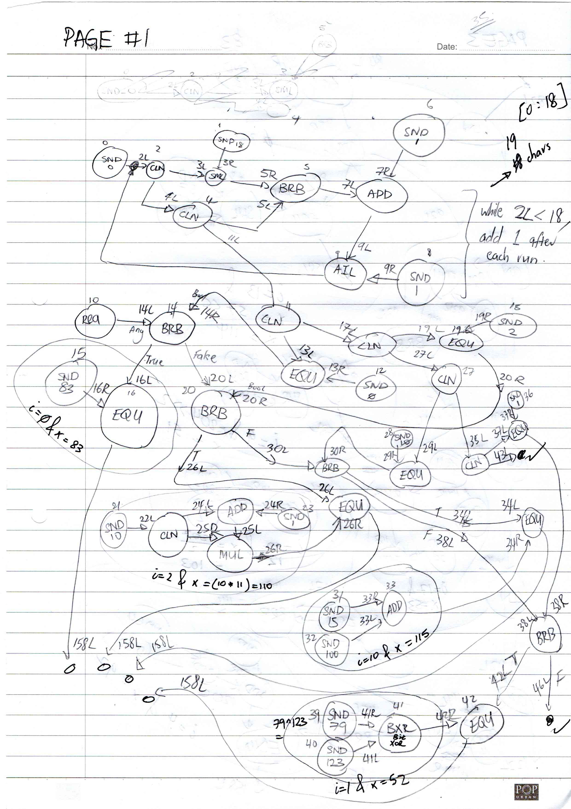
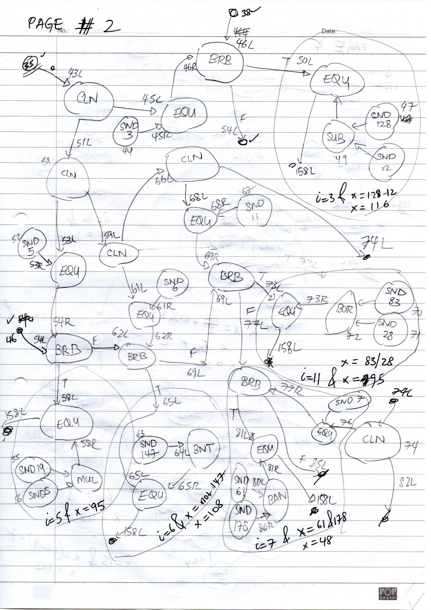
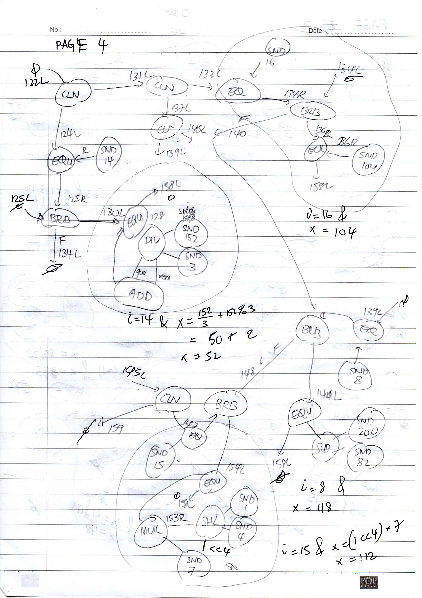
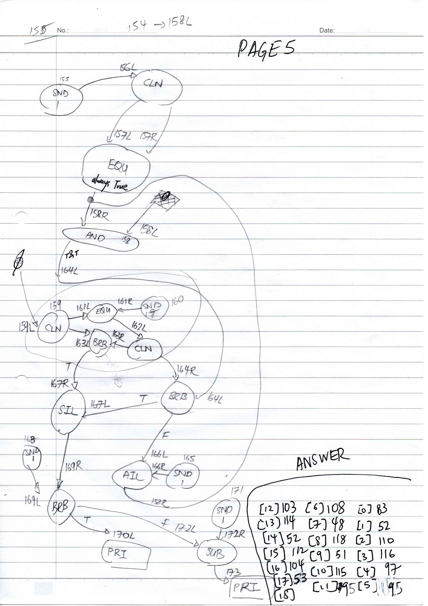

# Dataflow Programming Christmas Edition
Reverse

## Challenge 

	Santa's MechaGnomes have invented some new DataFlow language that they code the factory robots' instructions. You found a weird string checker, you need to interpret the code in order to recover the string! The flag obtained from the challenge must be wrapped up like: X-MAS{flag}

	chall

	Authors: Gabies + littlewho

## Solution

### Solving by hand

Converting the code into a graph by hand, I eventually founnd the pattern.

- CLN is used mostly to pass the index value (i=0 to i=18).
- Values are cloned and then EQU is used to check index value
- After which, BRB is used mostly to select the equation for checking of the integer values.
- At each BRB junction, there is an EQU to check for integer based on various math/bitwise operations/

With this, we get all the integers

	>>> bytes([83,52,110,116,97,95,108,48,118,51,115,95,103,114,52,112,104,53])
	b'S4nta_l0v3s_gr4ph5'

### Solving with an interpreter

I created an interpreter before I converted the code by hand, however, I thought it was not working since there was no output for each of the input I gave.

My interpreter actually works, but the code provided doesn't output the flag or any indicator onto the screen

Furthermore, the equality checks are not in order.

---

Hence, after manually decoding the flag, I added debugging prints to check the EQU operations.

> [code_output.txt](code_output.txt)

I sorted and filtered it all to give the following results.

	*** EQU 0 == 0 : 1*** EQU 1 == 83 : 0
	*** EQU 1 == 1 : 1*** EQU 1 == 52 : 0
	*** EQU 2 == 2 : 1*** EQU 1 == 110 : 0
	*** EQU 3 == 3 : 1*** EQU 1 == 116 : 0
	*** EQU 4 == 4 : 1*** EQU 1 == 97 : 0
	*** EQU 5 == 5 : 1*** EQU 1 == 95 : 0
	*** EQU 6 == 6 : 1*** EQU 1 == 108 : 0
	*** EQU 7 == 7 : 1*** EQU 1 == 48 : 0
	*** EQU 8 == 8 : 1*** EQU 1 == 118 : 0
	*** EQU 9 == 9 : 1*** EQU 1 == 51 : 0
	*** EQU 10 == 10 : 1*** EQU 1 == 115 : 0
	*** EQU 11 == 11 : 1*** EQU 1 == 95 : 0
	*** EQU 12 == 12 : 1*** EQU 1 == 103 : 0
	*** EQU 13 == 13 : 1*** EQU 1 == 114 : 0
	*** EQU 14 == 14 : 1*** EQU 1 == 52 : 0
	*** EQU 15 == 15 : 1*** EQU 1 == 112 : 0
	*** EQU 16 == 16 : 1*** EQU 1 == 104 : 0
	*** EQU 17 == 17 : 1*** EQU 1 == 53 : 0

The first EQU which outputs to True will be the index check pass.

The following EQU is the check against the integer. Hence, we can retrieve the values to get exactly the same as we decoded.

Similarly, we get the following values of the flag

	>>> bytes([83,52,110,116,97,95,108,48,118,51,115,95,103,114,52,112,104,53])
	b'S4nta_l0v3s_gr4ph5'

## Flag

	X-MAS{S4nta_l0v3s_gr4ph5}
