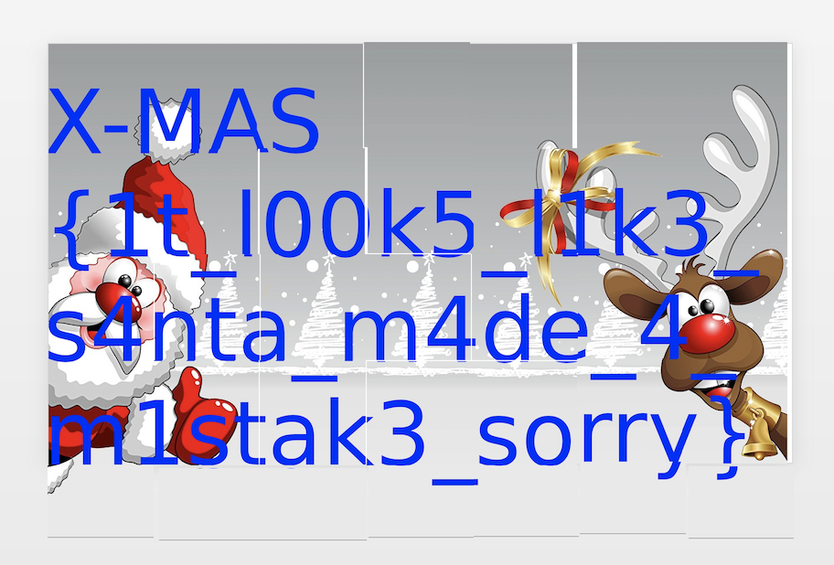

# Message from Santa
Forensics

## Challenge 

	Santa prepared a flag for you. Unfortunately, he has no idea where he left it. Finders keepers.

	classified_gift_distribution_schema.img

	Author: Googal

## Solution

Do foremost to extract the files

	$ foremost classified_gift_distribution_schema.img 

Now we see a mixed up grid of images with the flag.

I did it up in Powerpoint and we get the flag after solving it

## Flag

	X-MAS{1t_l00k5_l1k3_s4nta_m4de_4_m1stak3_sorry}
