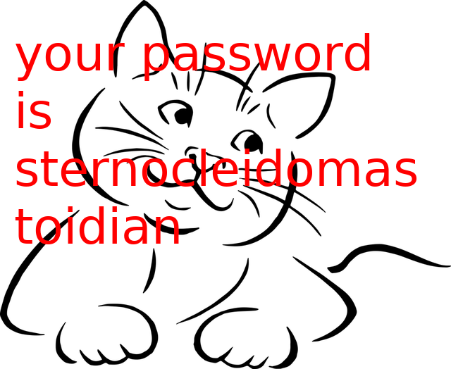

# Mission: Save the Christmas
Misc/Forensics

## Challenge 

	Santa's reindeers have been kidnapped! John Athan, Santa's right hand, has been watching you for a while and needs your help. Your mission, should you choose to accept it, is to help John Athan save Christmas.

	Author: Googal
	Server: nc 199.247.6.180 18000

## Solution

### Task 1

Solve the [first riddle](https://riddles.fyi/if-you-want-me-youll-have-to-share-me-but-if-you-share-me-i-will-be-gone-what-am-i/)

	$ nc 199.247.6.180 18000
	Hello! My name is John Athan. I am Santa's right hand. Unfortunately, the Christmas is in danger. The reindeers have been trapped behind a door that requires some sort of username, password combination. Your mission, should you choose to accept it, is to help me solve some tasks and save the Christmas. If successful, you will be rewarded with a lovely flag.

	 You have 3 lives. Good luck! 

	If you want me you'll have to share me but if you share me I will be gone. What am I?(one word)
	secret
	Congrats! Moving to the next task... 

### Task 2

And then we have to solve some hashes

	While you were struggling with that riddle I managed to extract some hashes, but triggered an alarm. I don't know much about them. They are 14 characters long and all of them contain the word 'stealer' and 7 digits. All the digits are placed after the word or before the word. The hash for the word 'admin' is -5290733415256081176 
	You only have 60 seconds. I'm validating the strings as you send them so any mistake is fatal. Send the usernames, one per line. Here's an example:
	Anyway here are the hashes:
	8634563874304265796
	-2680539599582735837
	3044209836108994507
	8188410016319800665
	1130092492162347202
	8088690117811803603
	4327812975033231375
	7501904586338093947
	-4394874216838974727
	142432960879921134

They all look like 64-bit long ints, but and it is not the common MD5/SHA etc...

	admin => 0xb69389fd865f3ce8

And after digging around, python has a built in hash function which outputs 64-bits integers on a 64-bit machine

	$ python3
	Python 3.6.3 (default, Oct  4 2017, 06:09:38) 
	[GCC 4.2.1 Compatible Apple LLVM 9.0.0 (clang-900.0.37)] on darwin
	Type "help", "copyright", "credits" or "license" for more information.
	>>> hash('admin')
	674860115036101840

	$ python
	Python 2.7.10 (default, Oct  6 2017, 22:29:07) 
	[GCC 4.2.1 Compatible Apple LLVM 9.0.0 (clang-900.0.31)] on darwin
	Type "help", "copyright", "credits" or "license" for more information.
	>>> hash('admin')
	-5290733415256081176

And to make it worse, it is the Python2 hash() function.

Doing a bruteforce manually and it is successful

	While you were struggling with that riddle I managed to extract some hashes, but triggered an alarm. I don't know much about them. They are 14 characters long and all of them contain the word 'stealer' and 7 digits. All the digits are placed after the word or before the word. The hash for the word 'admin' is -5290733415256081176 
	You only have 60 seconds. I'm validating the strings as you send them so any mistake is fatal. Send the usernames, one per line. Here's an example:
	Anyway here are the hashes:
	1350086870695764168
	224316871193337534
	-1002666726886268893
	-3999526643583420248
	-2452522549328823155
	-2041465019234233362
	-3446620126404344120
	1817130020080813107
	626348231050021546
	-6261803311994342148
	stealer2263584
	stealer1669925
	stealer9031219
	stealer8438690
	stealer8358340
	3645323stealer
	stealer0412566
	stealer2009606
	0705947stealer
	8260204stealer
	Congrats! Moving to the next task... 

### Task 3

Next challenge, they ask for the number of reindeers...

	Ok... I feel we're getting closer. I now need you to tell me how many reindeers are in this image.
	 https://pasteboard.co/HRfn1ys.jpg 
	You should send me (no_of_reindeers * (666 013)^3)  %  3796343071875732
	2418013902589934

	The answer is wrong. You have 2 lives left
	3107178487232833

	The answer is wrong. You have 1 lives left
	1332025

	The answer is wrong. You have 0 lives left
	You lost. The Christmas is lost. :( 

> [files/HRfn1ys.jpg ](files/HRfn1ys.jpg )

There are clearly 2 reindeers in the image, but the answer is not accepted...

We see more "reindeers" in the strings of the image

	 $ strings ~/Downloads/HRfn1ys.jpg | grep reindeer
	Copyright (c) 1998 Hidden reindeer Company
	red reindeer
	blue reindeer
	kiwi reindeer
	yellow reindeer.random reindeer. two reindeers.a small reindeer.a young reindeer.10 binary reindeers.funny reindeer.green reindeer.blue reindeer

Counting, we have 2 in the image and 15 in the strings (Take 10 binary reindeers = 2 reindeers).

So I calculate 17 reindeers

	>>> no_of_reindeers=17
	>>> (no_of_reindeers * (666013)**3)  %  8633451966289212
	6199522954259177

Send it

	Ok... I feel we're getting closer. I now need you to tell me how many reindeers are in this image.
	 https://pasteboard.co/HRfn1ys.jpg 
	You should send me (no_of_reindeers * (666 013)^3)  %  8633451966289212
	$ 6199522954259177
	Congrats! Moving to the next task... 

### Task 4

One last task?

	Nicely done! You might actually have a shot at saving the Christmas. I have another image for you to analyze, but I'm a bit confused. I need a password so I can see where the reindeers are trapped at.
	 https://pasteboard.co/HRwM0jU.png 

> [files/HRwM0jU.png](files/HRwM0jU.png)

Download the image and do a strings

	$ strings HRwM0jU.png | tail -5
	8.*"k~83
	dofF
	AxSN
	)Jpu
	winter.jpgUT

Hidden file? Foremost to extract `winter.jpg`.

	# foremost HRwM0jU.png 
	Processing: HRwM0jU.png
	|foundat=winter.jpgUT
	*|

Now take a look at `winter.jpg` again.

	$ strings winter.jpg | tail -5
	N}}O
	Wg"Q
	,IDAT
	IEND
	cat_finalUT

Another hidden file! Foremost to extract `cat_final`.

	# foremost winter.jpg 
	Processing: winter.jpg
	|foundat=cat_finalUT
	*|

Check `cat_final`. It is a corrupted PNG file.

From the "Raw profile type exif", we know it is a PNG file. (Sly... the PNG is reversed to GNP in the header)

	$ file cat_final 
	cat_final: data
	Mission__Save_the_Christmas $ xxd cat_final | head
	00000000: 8947 4e50 0d0a 1a0a 0000 000d 5244 4849  .GNP........RDHI
	00000010: 0000 0280 0000 020c 0806 0000 0065 bf1d  .............e..
	00000020: 8000 001a f87a 5458 7452 6177 2070 726f  .....zTXtRaw pro
	00000030: 6669 6c65 2074 7970 6520 6578 6966 0000  file type exif..
	00000040: 78da ed9a 5996 1c37 9245 ffb1 8a5e 0266  x...Y..7.E...^.f
	00000050: c096 83f1 9cde 412f bfef 4304 4551 5255  ......A/..C.EQRU
	00000060: 770d 9fa5 1499 c9c8 0877 c086 3718 dc9d  w........w..7...
	00000070: fff9 efeb fe8b ff6a b5ea 7269 9def d5f3  .......j..ri....
	00000080: 5fb6 6c71 f043 f79f ff3e df83 cfef ef1f  _.lq.C...>......
	00000090: 2fc5 efab bfbc eefc fafe 22f2 52e2 7bfa  /.........".R.{.

So I used my Python3 script to fix the file header

	$ python3 fix_png.py 

Still not enough, fix the 'IHDR'

	$ pngcheck -v cat_fixed.png 
	File: cat_fixed.png (72707 bytes)
	  chunk RDHI at offset 0x0000c, length 13:  first chunk must be IHDR
	ERRORS DETECTED in cat_fixed.png

Okay, modify my script and now it is fixed.

> your password is sternocleidomastoidian

### Task 5

Gah, another task!

	Congrats! Moving to the next task... 

	We're finally here. Behind this door that you are unable to see are Santa's reindeers. Give me the password and we shall save the Christmas. 
	 https://pasteboard.co/HRyG0yE.png 

> [files/HRyG0yE.png](files/HRyG0yE.png)

Misleading strings with the wrong password

	$ strings HRyG0yE.png | tail -3
	3`IrkX
	IEND
	your password is red_herring

In stegSolve, we see bits in the top left of RGB Plane 0.

However, trying to extract it gives no legible results (because I do not know the format of the bit order)

Use zsteg to help us...

> ZSteg References:
> - https://www.aldeid.com/wiki/Zsteg#Extraction
> - https://github.com/zed-0xff/zsteg

	$ gem install zsteg

	$ zsteg final.png 
	[?] 28 bytes of extra data after image end (IEND), offset = 0x16f427
	extradata:0         .. text: "your password is red_herring"
	imagedata           .. text: "wwwEEE{{{"
	b1,r,msb,xy         .. text: "\"a`zpk\"0 "
	b1,b,lsb,xy         .. text: "9P3T-{sB"
	b1,bgr,lsb,xy       .. text: "VmpKMFYyRXlTWGxVYTJoVlYwZG9VVll3Vmt0alZsSlhWVzVPVGxadGVIaFdSM2hQV1ZkS1NHVkdhRlZOVjJoNlYxWmFXbVZHVG5STlZuQlhWakZLV1Zkc1dtdFVNbEpJVTJ0c1YySlZXbkphVjNCQ1RsRTlQUT09\n"
	b2,r,lsb,xy         .. file: 5View capture file

Looks like base64. Decoding it gives another base64.

Decode for a few iterations and we get a password.

	$ encoded='VmpKMFYyRXlTWGxVYTJoVlYwZG9VVll3Vmt0alZsSlhWVzVPVGxadGVIaFdSM2hQV1ZkS1NHVkdhRlZOVjJoNlYxWmFXbVZHVG5STlZuQlhWakZLV1Zkc1dtdFVNbEpJVTJ0c1YySlZXbkphVjNCQ1RsRTlQUT09'

	$ echo $encoded | base64 -D | base64 -D | base64 -D | base64 -D | base64 -D | base64 -D
	this_is_not_a_red_herring

Finally

	Congrats! Moving to the next task... 

	We're finally here. Behind this door that you are unable to see are Santa's reindeers. Give me the password and we shall save the Christmas. 
	 https://pasteboard.co/HRyG0yE.png 
	You did it! You saved the Christmas! You may now go solve some more challenges. As promised, here is your flag:
	X-MAS{1_h4d_n0_id3a_th4t_you_c0uld_s4v3_th3_Chr1stm45}

> Automated script in [solve.py](solve.py) (Python 2.7 + pwntools)

## Flag

	X-MAS{1_h4d_n0_id3a_th4t_you_c0uld_s4v3_th3_Chr1stm45}
